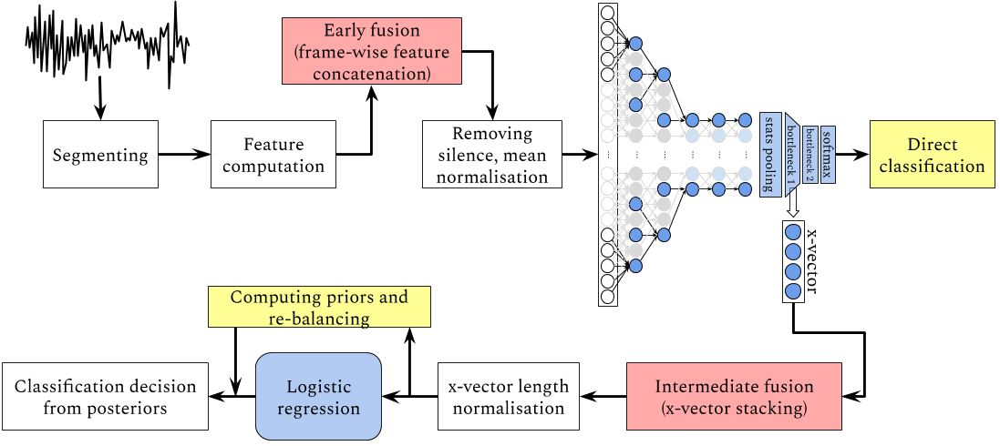

# Prosodic language identification from speech

This repo contains my Year 4 dissertation at the University of Edinburgh. The corresponding code project (a Kaldi recipe) can be found [here](https://github.com/samsucik/prosodic-lid-globalphone).

## Abstract (full work [here](latex/s1513472-minf1.pdf))

This report presents my work on the use of prosodic features for language identification using the recently proposed x-vector architecture. I discuss the differences between acoustic information and prosody and refer to past work that showed the usefulness of prosodic information when distinguishing between languages. For my experiments, I use the x-vector approach proposed by [Snyder et al. (2018)](https://www.danielpovey.com/files/2018_odyssey_xvector_lid.pdf), which uses a time-delay neural network (TDNN) to compute utterance-level embeddings that are subsequently processed by a light-weight classifier. While using 19 languages from the GlobalPhone corpus, I explore the use of popular acoustic features and two prosodic features: log energy and a continuous pitch curve extracted even for unvoiced speech using the algorithm proposed by [Ghahremani et al. (2014)](https://www.danielpovey.com/files/2014_icassp_pitch.pdf). The acoustic and prosodic information is used in isolation as well as in combination -- fusing the two types at the feature level and at the utterance embedding level. I observe that the addition of prosodic information to standard acoustic features improves the performance -- measured by the Cprimary metric from NIST LRE 2017 -- by as much as 37% and 28% for standard (&le;10s) and short (&le;3s) segments, respectively. My results also show that the energy and pitch information is very complementary and is best used in combination, concatenated frame-wise at the feature level. In particular, the prosodic information helps the system perform better for Slavic languages such as Bulgarian and Croatian, but also distinguish better between Asian languages like Korean and Japanese. I conclude that existing acoustic LID systems could benefit from the addition of a prosodic component which can be trained separately and fused at the utterance embedding level.

## Contents of this repo

In [`graphing/`](graphing), you'll find my awesome graphing Jupyter notebook and a special notebook for creating t-SNE visualisations of x-vectors (see also [`preprocess_xvectors.sh`](graphing/preprocess_xvectors.sh)), and also a lot of interesting raw data/notes/results going beyond what is presented in the dissertation write-up. Note that the notebooks are best run in a Python 3 Conda environment created from [`minf-report.yml`](minf-report.yml).

In [`img/`](img), there are graphs of all kinds to help you go beyond the data analysis in my report.

In [`results/`](results), you can find the results of all my experiments, in particular the summary of all experiments using single feature type and early feature fusion ([here](results/summary.csv)), and results for intermediate fusion experiments ([here](results/fusion_summary.csv)).
